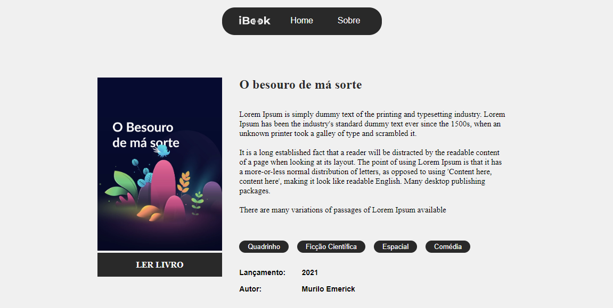

# Bookstore - read anywhere and anytime...

This project simulates a virtual library where books are displayed on the homepage and when you click on one of them, you are redirected to the book's details page. So, if you liked the book summary, click to read. 
Before we start, you can see the demo running at the link below.

<h3>
<a href="https://bookstore-react-eight.vercel.app/">Live Demo - Bookstore</a>
</h3>

<h3>Images<h3>
        

        

        

<h3>Bookstore gif</h3>
        

  

<h3>Folder structure</h3>
        

 

The Atomic design method was used to organize the components, you can read more about it at this link: 
<a href="https://atomicdesign.bradfrost.com/chapter-2/">Atomic Design Methodology</a>

  

<h2>Run Locally</h2>
<h3>1. Install Dependencies</h3>

    $ npm install

 
<h3>2. Run development server</h3>

    $ npm run start

 
<h3>3. Build the project</h3>

    $ npm run build

   

Made by Jabes Enock

